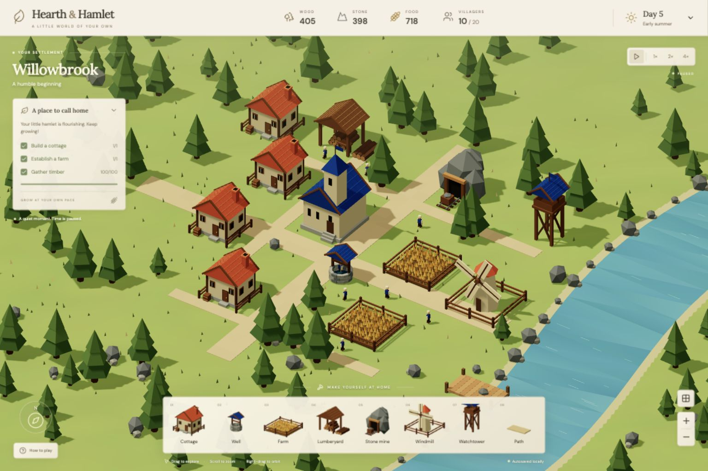

# Hearth & Hamlet

A playable, local-first medieval village builder made with **Blender + Three.js**, React, and Vite. All visible buildings, trees, rocks, fences, crops, and villagers are original Blender-exported geometry. The scene is interactive 3D, not an image background.



The game runs entirely in the browser. The core simulation does not require an account or a backend; the optional Village Advisor uses a small server-side OpenRouter proxy.

## Features

- Build a living low-poly settlement with cottages, farms, bakeries, inns, storehouses, lumberyards, mines, windmills, watchtowers, schools, vineyards, wells, grain fields, and paths.
- Watch villagers route around buildings and scenery, construct new sites, harvest renewable resources, process goods, eat, train at the School, and deliver finished stock through the village logistics network.
- Shape the settlement with grid-snapped placement, connected path segments, a day/night cycle, animated water and foliage, dusk lanterns, and adjustable graphics and audio settings.
- Work through settlement milestones, inspect buildings and villagers, review live activity in the village overview, and ask the optional advisor what to build next.
- Continue locally with autosaves, manual save, named villages, conflict-safe multi-tab behavior, and validated export/import backups.

## Continuing with an AI agent

Start with [HANDOFF.md](HANDOFF.md). It captures the current worktree state, the safe verification loop, and the most useful next places to inspect. [AGENTS.md](AGENTS.md) is the concise, tool-neutral operating guide; [CLAUDE.md](CLAUDE.md) is an entry point for Claude Code. Read [ARCHITECTURAL.md](ARCHITECTURAL.md) before changing the simulation or persistence and [DESIGN.md](DESIGN.md) before changing the interface.

## Requirements

- Node.js 18 or newer
- A modern browser with WebGL enabled
- Blender only if you want to regenerate the source assets

## Run

```sh
npm install
npm run dev
```

Open the localhost URL printed by the server. If port 5173 is busy, the server selects the next available port automatically.

To run the built app locally:

```sh
npm run build
npm run preview
```

`npm run dev`, `npm run preview`, and `npm start` use `server.js`, which serves the app and the `/api/advisor` route.

The Village Advisor uses OpenRouter through a server-side route. Locally, `server.js` handles the route; on Vercel, `api/advisor.js` runs it as a Vercel Function. Copy `.env.example` to `.env.local`, add your `OPENROUTER_API_KEY`, then restart the dev server. The key is only read server-side and is never bundled into the browser.

```sh
cp .env.example .env.local
```

The advisor is optional: the village remains playable without a key, but advisor requests will show a configuration message. `OPENROUTER_MODEL` selects the OpenRouter model, and `OPENROUTER_SITE_URL` is optional attribution metadata.

```sh
npm test          # simulation and placement checks
npm run build     # production bundle check
```

The test suite runs in Node and covers placement validation, routing, production and delivery, persistence sanitization, progression, and advisor behavior. A browser is only needed for the interactive 3D experience and the optional `/health-check` performance page.

## Performance health check

Open `/health-check` on the deployed game (for example, `https://your-domain/health-check`) to run a real game startup sample. The page reports the game payload, startup milestones, 3D model and JavaScript weight, frame rate, long tasks, WebGL renderer, device capabilities, and the largest resources observed by the browser. Run it after adding assets or interactions; for a realistic phone baseline, use a hard reload on the phone over cellular data.

## Build palette

The first nine cards match the keyboard shortcuts; later cards remain
available directly from the palette:

| Key | Building | Cost | Effect |
| --- | --- | --- | --- |
| 1 | Cottage | 30 wood · 10 stone | +2 housing capacity; villagers are trained at the School |
| 2 | Well | 15 wood · 25 stone | Village gathering place |
| 3 | Farmhouse | 25 wood · 5 stone | Farmers harvest connected ripe fields |
| 4 | Bakery | 40 wood · 25 stone | Turns 3 wheat into 5 bread per 12-second cycle; holds 5 |
| 5 | Inn | 55 wood · 25 stone | Holds 8 bread for 3 hungry villagers; overflow goes to a Storehouse |
| 6 | Storehouse | 40 wood · 60 stone | Adds 150 storage for every resource and posts 3 carriers |
| 7 | Grain field | 1 food per tile | Grows in 30 seconds; a farmhouse harvests 8 wheat per plot |
| 8 | Lumberyard | 20 wood · 10 stone | Workers chop nearby trees and saw +8 wooden planks per cycle |
| 9 | Stone mine | 35 wood · 15 stone | +6 stone per cycle; holds 12 |
| — | Windmill | 50 wood · 35 stone | Converts 2 food into 8 food per 20-second cycle; holds 16 |
| — | Watchtower | 45 wood · 20 stone | Expands the buildable boundary by 3 tiles |
| — | School | 60 wood · 45 stone | Trains builders and tradesfolk; needs housing room |
| — | Vineyard | 45 wood · 30 stone | Produces +6 wine per 20-second cycle; holds 12 |
| — | Path | 1 stone per tile | Villagers move 50% faster; open ground slows them to 0.7× |

Workers are assigned automatically. Builders handle construction, while lumberyards employ up to 2 woodcutters and farms, mines, bakeries, windmills, and vineyards employ up to 1 specialist each. Windmills use a baker slot for their food-processing loop. A School can train builders or tradesfolk over time, and each completed cottage houses 2 workers up to the 24-villager simulation cap. Completed farms and windmills can also be upgraded from their inspectors.

The starter village includes a town hall and several completed structures. The first settlement milestones track a player-built cottage, a player-built farmhouse, and 100 gathered timber. A later chapter tracks 12 new path tiles, 32 delivered food, and a second completed cottage with a well. Completing each set produces a one-time acknowledgement.

## Deploy to Vercel

From the project root, link or create the Vercel project and add the production environment variables without committing them:

```sh
vercel link
vercel env add OPENROUTER_API_KEY production
vercel env add OPENROUTER_MODEL production
vercel env add OPENROUTER_SITE_URL production
vercel --prod
```

Use the deployed Vercel URL for `OPENROUTER_SITE_URL`. The Vercel deployment serves the Vite build from `dist/` and the advisor at `/api/advisor`. `OPENROUTER_API_KEY` is required only if the deployed advisor should be available.

## Implemented systems

- **World:** grassy terrain with subtle color variation, a toggleable 1-unit grid, orthographic pan/zoom/orbit camera, warm sunlight and shadows, a morning-to-night cycle with dusk lanterns, animated foliage, water highlights, ambient motes, distant birds, and a curved river with ripples, rocks, reeds, and a wooden landing.
- **Assets:** pine trees, faceted rocks, timber fences, cottages, a masonry well, farm, bakery, inn, storehouse, lumberyard, rocky mine, rotating windmill, watchtower, school, vineyard, town hall, and villagers.
- **Simulation:** automatic job assignment, obstacle-aware grid routing, renewable tree harvesting, grain growth and harvest, capped worksite stock, carrier deliveries, bounded storage, hunger, training, upgrades, visible carried goods, delivery bursts, activity feedback, and settlement progression.
- **Building:** translucent grid-snapped previews validate land, obstacles, resources, and footprints before payment. Workers travel to sites, construct scaffolding and rising geometry, and add finished buildings to the village simulation.

## Controls

- Drag: pan. Right-drag: orbit. Scroll or +/-: zoom. Compass: reset camera.
- Click a completed building: inspect its role, current worker status, assignments, and deliveries. Click a villager to inspect their current task, work-cycle progress, next delivery estimate, and carried goods. Connected paths influence worker routing as well as movement speed.
- When housing is full, the population indicator and settlement status call out that another cottage is needed.
- Choose a palette item, then click valid terrain to build. Grain fields must start beside a completed farmhouse and may then extend from another connected plot. Drag while Grain field or Path is selected to lay a connected segment; diagonal drags choose the clearer Manhattan turn around obstacles. Grain advances from tilled soil to shoots, green-gold stalks, and ripe wheat before a farmer harvests it. Green preview = valid; red = blocked.
- **R:** rotate preview. **Esc:** cancel. **B:** cottage. **G:** grid.
- **1–9:** choose the first nine tools from the palette; use the palette directly for the remaining building, path, and removal tools.
- **Arrow keys:** pan the camera, or move the placement cursor while placing a building or path.
- **?:** open the help dialog.
- **Village advisor:** ask for context-aware advice about resources, workers, goals, and the next building to place.
- **Space:** pause/resume. Use 1×, 2×, and 4× to control simulation speed.
- Touch: drag to pan and pinch to zoom; tap the palette and terrain to place. When Path is selected, drag across terrain to lay a segment.
- Saves automatically in this browser, plus a manual Save village action in the top-right menu. Sparse or partially repaired saves retain recoverable progress while keeping first-build milestones tied to completed player-built structures.
- Village overview summarizes population, structures, active jobs, deliveries, built paths, settlement milestones, and recent village activity.
- Rename the settlement from the top-right village menu; the name is saved with the village.
- Respects `prefers-reduced-motion` by keeping the simulation usable while pausing decorative world motion.

## Progression and village management

The top-left goals panel shows the starter milestones and the current chapter. The village overview adds a compact readout of population, completed structures, active jobs, deliveries, paths, worksite focus, worker roles, recent activity, graphics presets, atmosphere settings, and milestone progress. Select a listed worksite or villager to focus it in the world.

Use the village menu to rename the settlement, save immediately, export a JSON backup, import a validated backup, open the overview or help dialog, and reset to the original settlement. Saves remain in this browser under `hearth-v1`; there is no account-backed or cloud save. If another tab changes the same village, the older tab pauses and asks to reload before it can write again.

## Blender source and exports

`blender/village-assets.blend` contains the editable asset collection, arranged as a gallery. `public/models/*.glb` are the runtime models. `blender/create_assets.py` deterministically regenerates both from scratch; static meshes are combined by material to reduce draw calls.

With Blender on PATH:

```sh
npm run assets
```

On this Mac:

```sh
/Applications/Blender.app/Contents/MacOS/Blender --background --python blender/create_assets.py
```

Runtime UI thumbnails are rendered directly from the same GLB models. The generated design concept is documentation only and is never used as the game background.

## Persistence and project layout

Village state is saved to browser `localStorage` under `hearth-v1`. It includes the settlement name, resources, villagers' hunger and trades, buildings, construction progress, worksite stock, training and pause state, deliveries, paths, active tree state, milestones, activity history, camera framing, and cleared scenery. Autosave runs during simulation, and the village menu provides manual save, rename, overview, help, and reset actions. A tab that detects a newer save freezes simulation and offers a reload action so it cannot overwrite the newer village.

Key files:

- `src/main.jsx` — React UI, controls, modals, advisor panel, and accessibility behavior
- `src/world.js` — Three.js scene, simulation, routing, building validation, persistence, and rendering
- `src/catalog.js` — building definitions, costs, effects, and production timings
- `src/progression.js` — milestone detection and restore-safe progression rules
- `blender/create_assets.py` — deterministic Blender asset generation
- `server.js` and `api/advisor.js` — local and Vercel advisor endpoints
- `tests/simulation.test.js` — simulation, validation, persistence, and interaction tests

## Scope

This is a complete small sandbox for the requested four stages. Jobs are assigned automatically; the economy has renewable production, with no combat, seasons affecting gameplay, resource-node depletion, or survival failure. The day indicator advances every two simulation minutes and shows the current period while the world lighting shifts from morning through night. Saves persist buildings, construction progress, delivery history, resources, population, day, goals, and camera framing; workers receive fresh routes after reload. The advisor endpoint runs through the local server in development or a Vercel Function in production; there is no account or cloud save. Display fonts fall back to system fonts offline.

See `docs/verification.md` for browser checks and visual comparison notes.
